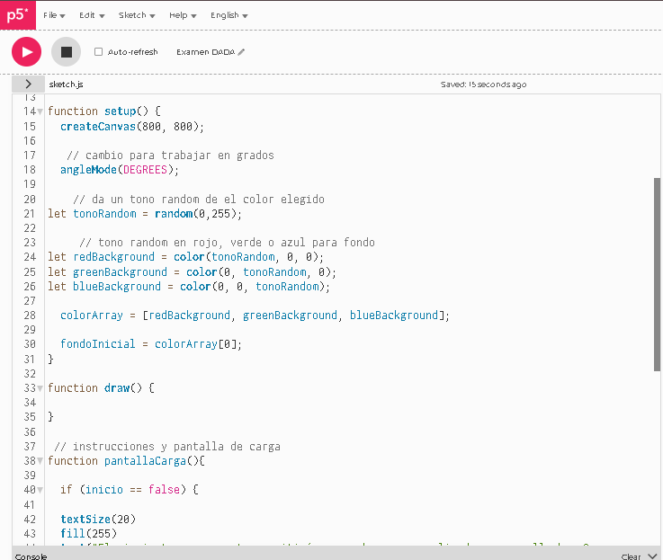
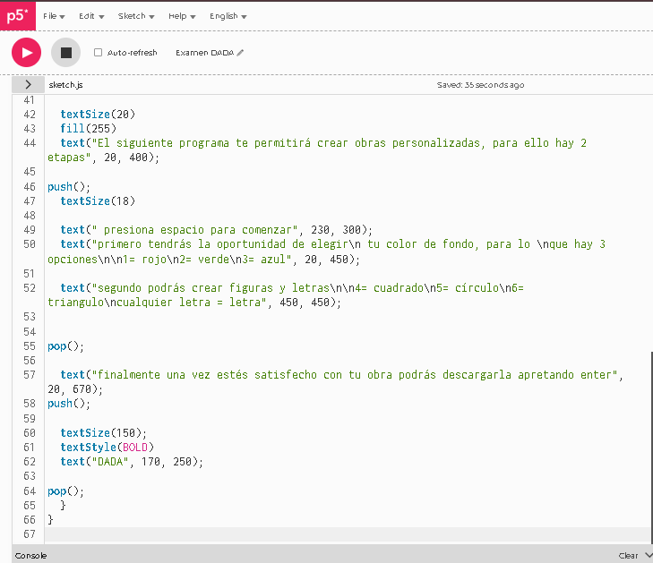

# Examen-Pensamiento-Computacional

El nombre del proyecto es DADA, fue concebido y fabricado por Josefa Luque. El proyecto trabaja como un fabricante de obras artísticas abstractas, pero por detrás toma inspiración en la corriente llamada dadaísmo para presentar una crítica, para esto toma la fachada de fabricante de obras cuando esconde decisiones y un final del usuario, llegando incluso a poseer una declaración falsa en las instrucciones. Se procederá a explicar en más profundidad, desde la perspectiva real.

Cuando se empieza aparecen unas indicaciones en la pantalla, explicando que el programa crea obras en base a 2 etapas, estas siendo primero, la selección del fondo, luego la creación de figuras y letras, finalmente se dice que una vez lista la obra, se debe presionar enter para guardar la obra. Esta última declaración es falsa ya que una vez se apreta enter se activa un nested loop que llenará la pantalla con una malla de imágenes que dicen ¿Puedes llamar a esto realmente tu obra?

Cuando hablamos inputs los utilizados son puramente teclas, 1, 2, y 3 se usan para cambiar el color de fondo, teniendo la particularidad de que están conectadas a un array, las teclas 4, 5, y 6 corresponden primero a cuadrado, círculo y triángulos, en caso de presionar letras, aparece la letra, tanto en caso de figuras como letras, estas aparecen en una ubicación random, con color random y rotación random, en caso de el triángulo el último vértice de este aparece en función de la ubicación de mouse.

Como se explicó al inicio, este proyecto al ser la mejora de uno anterior mantiene la misma inspiración, siendo esta la corriente del dadaísmo, es especial la obra de Marcel Duchamp. 

 

Esta crítica hacia la autoría de las obras tiene muchas similitudes según mi persona con la situación actual con la ia, debido a esto es que generó una motivación personal y un deseo por expresar de manera correcta este mensaje. El diseño crítico es una rama sumamente importante ya que nos permite reflexionar sobre nuestra situación y guiarnos hacia el cambio.

Como se ve en el diagrama de flujo, este código está dividido en 4 etapas, primero la pantalla de carga o inicio, posteriormente el cambio de fondo, luego figuras/letras y por último el final con malla.

En su mayoría el código recibe una tecla y en base a ello ejecuta diferentes procesos, los más destacables son por ejemplo el array que no solamente recibe la tecla, si no que la transforma en número, esto debido a que la tecla la considera como un string y además aplica -1 esto debido a que el array comienza desde el 0, así el usuario no debe pensar en que 0 = 1 y directamente presiona los números.

En este código aprendí diferentes cosas como por ejemplo el uso de && como condición doble, en este caso necesitando que ambas declaraciones sean ciertas para funcionar, esto ayuda muchísimo con las etapas; el uso de (figuras) que representa el boolean siendo verdadero y (!figuras) representando que es negativo; también el uso de test.key para comprobar que es efectivamente una letra.

La imagen utilizada es la siguiente 

Esta decisión fue tomada con la idea de simplificar el nest loop, anteriormente se necesitaba un cálculo matemático pero ahora como se usan solo 2 coordenadas, ya no es necesario, así reduciendo la cantidad de código.

Al comienzo comencé distribuyendo mi código anterior en un nuevo archivo para así tener una base de la que empezar a trabajar, si bien no todo fue pasado a este archivo, sirvió muchísimo como guía base.

Posteriormente se comenzó a añadir todas las cosas nuevas como en este caso las instrucciones del inicio, y posteriormente cosas como la imagen o el nuevo loop, también el texto en la etapa 2.

Si hay algo que pueda decir de este proyecto es que me encuentro bastante satisfecha, esto debido que las etapas ayudan muchísimo a dar forma a este proyecto, creo que anteriormente deseaba hacer algo así pero las limitaciones en conocimiento no me dejaban crearlo, mis aprendizajes a lo largo del proceso como el uso de && me parecieron sumamente interesantes. desearía haber poseído más tiempo para poder complejizar aún más pero eso no quiere decir que no aprecie este proyecto.

https://editor.p5js.org/josefa.luque/sketches/IqlazwyPY
