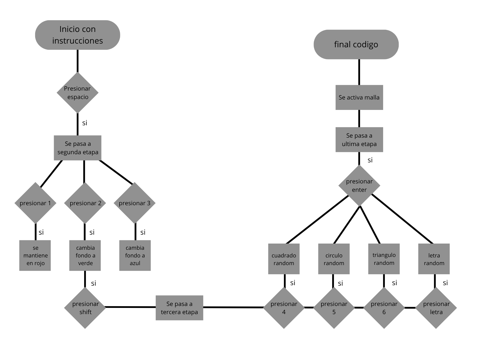

# Examen-Pensamiento-Computacional

El nombre del proyecto es DADA, fue concebido y fabricado por Josefa Luque. El proyecto trabaj como un fabricante de obras artisticas abstractas, pero por detras toma inspiracion en la corriente llamada dadaismo para presentar una critica, para esto toma la fachada de fabricante de obras cuando esconde decisiones y un final del usuario, llegando incluso a poseer una declaracion falsa en las instrucciones. Se procedera a explicar en más profundidad, desde la perspectiva real.

Cuando se empieza aparecen unas indicaciones en la pantalla, explicando que el programa crea obras en base a 2 etapas, estas siendo primero, la seleccion del fondo, luego la creaccion de figuras y letras, finalmente se dice que una vez lista la obra, se debe presionar enter para guardar la obra. Esta ultima declaracion es falsa ya que una vez se apreta enter se activa un nest loop que llenara la pantalla con una malla de imagenes que dicen ¿Puedes llamar a esto realmente tu obra?

Cuando hablamos inputs los utilizados son puramente teclas, 1, 2, y 3 se usan para cambiar el color de fondo, teniendo la particularidad de que estan conectadas a un array, las teclas 4, 5, y 6 corresponden primero a cuadrado, circulo y triangulos, en caso de precionar letras, aparece la letra, tanto en caso de figuras como letras, estas aparecen en una ubicacion random, con color random y rotacion random, en caso de el triangulo el ultimo vertice de este aparece en funcion de la ubicacion de mouse.

Como se explico al inicio, este proyecto al ser la mejora de uno anterior mantiene la misma inspiracion, siendo esta la corriente del dadaismo, es especial la obra de Marcel Duchamp. 
 

Esta critica hacia la autoria de las obras tiene muchas similitudes segun mi persona con la situacion actual con la ia, debido a esto es que genero una motivacion personal y un deseo por expresar de manera correcta este mensaje. El diseño critico es una rama sumamente importante ya que nos permite reflexionar de nuestra situacion y guiarnos hacia el cambio.

como se ve en el diagrama de flujo, este codigo esta dividido en 4 etapas, primero la pantalla de carga o inicio, posteriormente el cambio de fondo, luego figuras/letras y por ultimo el final con malla.

En su mayotia el codigo recibe una tecla y en base a ello ejecuta diferentes procesos, los mas destacables son por ejemplo el array que no solamente reicbe la tecla, si no que la transforma en numero, esto debido a que la tecla la considera como un string y ademas aplica -1 esto debido a que el array comienza desde el 0, asi el usuario no debe pensar en que 0 = 1 y directamente presiona los nhumeros.

En este codigo aprendi diferentes cosas como por ejemplo el uso de && como condicion doble, en este caso necesitando que ambas declaraciones sean ciertas para funcionar, esto ayuda muchisimo con las etapas; el uso de (figuras) que representa el boolean siendo verdadero y (!figuras) representando que es negativo; tambien el uso de test.key para comprobar que es efectivamente una letra.

La imagen utilizada es la sigiente 
